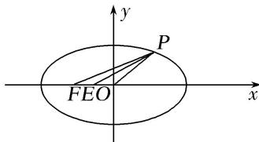

> [!faq]- 教师版对点训练解析
>
> > [!success]- **【答案】** C
>
> > [!note]- **【分析】**
> > 本题未单列分析。
>
> > [!note]- **【解析】**
> > 答案 C 解析 如图，由已知 $|OF|=1$ ，取 $FO$ 中点 $E$ ，连接 $PE$ ，由极化恒等式得： $\overrightarrow{OP}\cdot\overrightarrow{FP}=|PE|^{2}-\frac{1}{4}|OF|^{2}=|PE|^{2}-\frac{1}{4}$ ， $\because |PE|_{\max}^{2}=\frac{25}{4}$ ， $\therefore \overrightarrow{OP}\cdot\overrightarrow{FP}$ 的最大值为 6.
> > 
