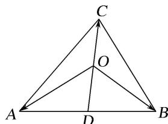

> [!faq]- 《专题9 平面向量的奔驰定理-平面向量》例题解析
>
> > [!success]- **【答案】** 详见解析
>
> > [!note]- **【分析】**
> > 本题未单列分析。
>
> > [!note]- **【解析】**
> > 答案 4 解析 $\because D$ 为 $AB$ 的中点，则 $\overrightarrow{OD} = \frac{1}{2} (\overrightarrow{OA} +\overrightarrow{OB})$ ，又 $\overrightarrow{OA} +\overrightarrow{OB} +2\overrightarrow{OC} = 0$ ， $\therefore \overrightarrow{OD} = -\overrightarrow{OC}$ ， $\therefore O$ 为 $CD$ 的中点．又 $\because D$ 为 $AB$ 的中点， $\therefore S_{\triangle AOC} = \frac{1}{2} S_{\triangle ADC} = \frac{1}{4} S_{\triangle ABC}$ ，则 $\frac{S_{\triangle ABC}}{S_{\triangle AOC}} = 4.$
> > 
> > 秒杀 因为 $\overrightarrow{OA} + \overrightarrow{OB} + 2\overrightarrow{OC} = 0$ ，根据奔驰定理得， $\frac{S_{\triangle ABC}}{S_{\triangle AOC}} = 4$ .
