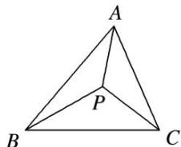
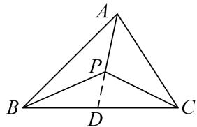

# 专题九 平面向量的奔驰定理

## 1. 奔驰定理

如图，已知 P 为 $\triangle ABC$ 内一点，则有 $S_{\triangle PBC} \cdot \overrightarrow{PA} + S_{\triangle PAC} \cdot \overrightarrow{PB} + S_{\triangle PAB} \cdot \overrightarrow{PC} = 0$ .

证明：如图，延长 $AP$ 与 $BC$ 边相交于点则 $D$ ， $\frac{BD}{DC} = \frac{S_{\triangle ABD}}{S_{\triangle ACD}} = \frac{S_{\triangle BPD}}{S_{\triangle CPD}} = \frac{S_{\triangle ABD} - S_{\triangle BPD}}{S_{\triangle ACD} - S_{\triangle CPD}} = \frac{S_{\triangle PAB}}{S_{\triangle PAC}}$

$$
\because \overrightarrow {P D} = \frac {D C}{B C} \overrightarrow {P B} + \frac {B D}{B C} \overrightarrow {P C}, \quad \therefore \overrightarrow {P D} = \frac {S _ {\triangle P A C}}{S _ {\triangle P A C} + S _ {\triangle P A B}} \overrightarrow {P B} + \frac {S _ {\triangle P A B}}{S _ {\triangle P A C} + S _ {\triangle P A B}} \overrightarrow {P C},
$$

$$
\because \frac {P D}{P A} = \frac {S _ {\triangle B P D}}{S _ {\triangle B P A}} = \frac {S _ {\triangle C P D} S _ {\triangle B P D} + S _ {\triangle C P D}}{S _ {\triangle C P A} S _ {\triangle B P A} + S _ {\triangle C P A}} = \frac {S _ {\triangle P B C}}{S _ {\triangle P A C} + S _ {\triangle P A B}}, \quad \therefore \overrightarrow {P D} = - \frac {S _ {\triangle P B C}}{S _ {\triangle P A C} + S _ {\triangle P A B}} \overrightarrow {P A},
$$

$$
- \frac {S _ {\triangle P B C}}{S _ {\triangle P A C} + S _ {\triangle P A B}} \overrightarrow {P A} = \frac {S _ {\triangle P A C}}{S _ {\triangle P A C} + S _ {\triangle P A B}} \overrightarrow {P B} + \frac {S _ {\triangle P A B}}{S _ {\triangle P A C} + S _ {\triangle P A B}} \overrightarrow {P C}, \therefore S _ {\triangle P B C} \cdot \overrightarrow {P A} + S _ {\triangle P A C} \cdot \overrightarrow {P B} + S _ {\triangle P A B} \cdot \overrightarrow {P C} = 0.
$$

由于这个定理对应的图象和奔驰车的标志很相似，我们把它称为“奔驰定理”。这个定理对于利用平面向量解决平面几何问题，尤其是解决跟三角形的面积和“四心”相关的问题，有着决定性的基石作用。奔驰定理是三角形四心向量式的完美统一。

推论：已知 P 为 $\triangle ABC$ 内一点，且 $x\overrightarrow{PA} + y\overrightarrow{PB} + z\overrightarrow{PC} = 0$ . (x, y, $z \in R$ , $xyz \neq 0$ , $x + y + z \neq 0$ ). 则有
(1) $S_{\triangle PBC}:S_{\triangle PAC}:S_{\triangle PAB}=|x|:|y|:|z|$ .

$$
\frac {S _ {\triangle P B C}}{S _ {\triangle A B C}} = \left| \frac {x}{x + y + z} \right|, \frac {S _ {\triangle P A C}}{S _ {\triangle A B C}} = \left| \frac {y}{x + y + z} \right|, \frac {S _ {\triangle P A B}}{S _ {\triangle A B C}} = \left| \frac {z}{x + y + z} \right|.
$$

![[高中/总复习/专题/平面向量/专题9 平面向量的奔驰定理-平面向量/例题选讲/例题选讲.md]]
![[高中/总复习/专题/平面向量/专题9 平面向量的奔驰定理-平面向量/对点训练/对点训练.md]]
