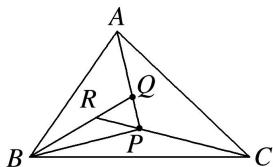

<!-- question-source:start -->
(3)已知点 $A$ ， $B$ ， $C$ ， $P$ 在同一平面内， $\overrightarrow{PQ} = \frac{1}{3}\overrightarrow{PA}$ ， $\overrightarrow{QR} = \frac{1}{3}\overrightarrow{QB}$ ， $\overrightarrow{RP} = \frac{1}{3}\overrightarrow{RC}$ ，则 $S_{\triangle ABC}:S_{\triangle PBC}$ 等于（

A. $14:3$ B. $19:4$ C. $24:5$ D. $29:6$
<!-- question-source:end -->

![[高中/总复习/专题/平面向量/专题9 平面向量的奔驰定理-平面向量/例题选讲/例题/answers/Q00033101A1.md]]
