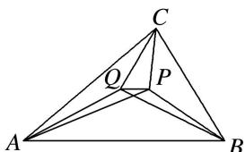

<!-- question-source:start -->
(4)已知点 $P$ ， $Q$ 在 $\triangle ABC$ 内， $\overrightarrow{PA} +2\overrightarrow{PB} +3\overrightarrow{PC} = 2\overrightarrow{QA} +3\overrightarrow{QB} +5\overrightarrow{QC} = \mathbf{0}$ ，则 $\frac{|\overrightarrow{PQ}|}{|\overrightarrow{AB}|}$ 等于（

A. $\frac{1}{30}$ B. $\frac{1}{31}$ C. $\frac{1}{32}$ D. $\frac{1}{33}$
<!-- question-source:end -->

![[高中/总复习/专题/平面向量/专题9 平面向量的奔驰定理-平面向量/例题选讲/例题/answers/Q00033102A1.md]]
