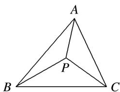

<!-- question-source:start -->
(6)设点 P 在 $\triangle ABC$ 内且为 $\triangle ABC$ 的外心， $\angle BAC = 30^{\circ}$ ，如图．若 $\triangle PBC, \triangle PCA, \triangle PAB$ 的面积分别为 $\frac{1}{2}, x, y$ ，则 $x + y$ 的最大值是 \_\_\_\_.

<!-- question-source:end -->

![[高中/总复习/专题/平面向量/专题9 平面向量的奔驰定理-平面向量/例题选讲/例题/answers/Q00033104A1.md]]
