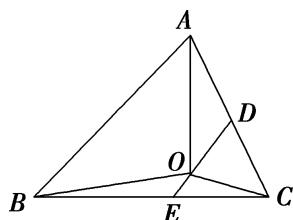

> [!faq]- 教师版例题解析
>
> > [!success]- **【答案】** A
>
> > [!note]- **【分析】**
> > 本题未单列分析。
>
> > [!note]- **【解析】**
> > 答案 A 解析 分别取 AC、BC 的中点 D、E，∵ $\overrightarrow{OA} + 2\overrightarrow{OB} + 3\overrightarrow{OC} = 0$ ，∴ $\overrightarrow{OA} + \overrightarrow{OC} = -2(\overrightarrow{OB} + \overrightarrow{OC})$ ，即 $2\overrightarrow{OD} = -4\overrightarrow{OE}$ ，∴ O 是 DE 的一个三等分点，∴ $\frac{S_{\triangle ABC}}{S_{\triangle AOC}} = 3$ .
> > 
> > 秒杀 根据奔驰定理得， $S_{\triangle ABC}:S_{\triangle AOC}=(1+2+3):2=3.$
