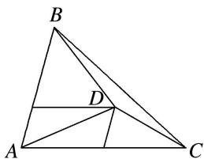

> [!faq]- 教师版例题解析
>
> > [!success]- **【答案】** B
>
> > [!note]- **【分析】**
> > 本题未单列分析。
>
> > [!note]- **【解析】**
> > 答案 B 解析 如图，由点 D 在 $\triangle ABC$ 中与 AB 平行的中位线上，且在靠近 BC 边的三等分点处，从而有 $S_{\triangle ABD} = \frac{1}{2} S_{\triangle ABC}$ ， $S_{\triangle ACD} = \frac{1}{3} S_{\triangle ABC}$ ， $S_{\triangle BCD} = \left(1 - \frac{1}{2} - \frac{1}{3}\right) S_{\triangle ABC} = \frac{1}{6} S_{\triangle ABC}$ ，所以 $\frac{S_{\triangle BCD}}{S_{\triangle ABD}} = \frac{1}{3}$ .
> > 
> > 秒杀 由 $\overrightarrow{AD}=\frac{1}{3}\overrightarrow{AB}+\frac{1}{2}\overrightarrow{AC}$ 得， $\overrightarrow{DA}+2\overrightarrow{DB}+3\overrightarrow{DC}=0$ ，根据奔驰定理得， $S_{\triangle BCD}:S_{\triangle ABD}=1:3.$
