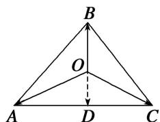

> [!faq]- 教师版对点训练解析
>
> > [!success]- **【答案】** 详见解析
>
> > [!note]- **【分析】**
> > 本题未单列分析。
>
> > [!note]- **【解析】**
> > 答案 $\frac{1}{2}$ 解析 设 $D$ 为 $AC$ 的中点，连接 $OD$ ，则 $\overrightarrow{OA} + \overrightarrow{OC} = 2\overrightarrow{OD}$ . 又 $\overrightarrow{OA} + \overrightarrow{OC} = -2\overrightarrow{OB}$ ，所以 $\overrightarrow{OD} = -\overrightarrow{OB}$ ，即 $O$ 为 $BD$ 的中点，从而容易得 $\triangle AOB$ 与 $\triangle AOC$ 的面积之比为 $\frac{1}{2}$ .
> > 
> > 秒杀 由 $\overrightarrow{OA} + \overrightarrow{OC} = -2\overrightarrow{OB}$ ，得 $\overrightarrow{OA} + \overrightarrow{OC} + 2\overrightarrow{OB} = 0$ ，根据奔驰定理得， $\triangle AOB$ 与 $\triangle AOC$ 的面积之比为 $\frac{1}{2}$ .
