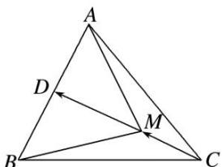

> [!faq]- 教师版对点训练解析
>
> > [!success]- **【答案】** C
>
> > [!note]- **【分析】**
> > 本题未单列分析。
>
> > [!note]- **【解析】**
> > 答案 C 解析 因为 D 是 AB 的中点，所以 $\overrightarrow{AB}=2\overrightarrow{AD}$ ，因为 $5\overrightarrow{AM}=\overrightarrow{AB}+3\overrightarrow{AC}$ ，所以 $2\overrightarrow{AM}-2\overrightarrow{AD}=3\overrightarrow{AC}-3\overrightarrow{AM}$ ，即 $2\overrightarrow{DM}=3\overrightarrow{MC}$ ，所以 $5\overrightarrow{DM}=3\overrightarrow{DM}+3\overrightarrow{MC}=3\overrightarrow{DC}$ ，所以 $\overrightarrow{DM}=\frac{3}{5}\overrightarrow{DC}$ ，设 $h_{1}, h_{2}$ 分别是 $\triangle ABM, \triangle ABC$ 的 AB 边上的高，所以 $\frac{S_{\triangle ABM}}{S_{\triangle ABC}}=\frac{\frac{1}{2}\times AB\times h_{1}}{\frac{1}{2}\times AB\times h_{2}}=\frac{h_{1}}{h_{2}}=\frac{DM}{DC}=\frac{|\overrightarrow{DM}|}{|\overrightarrow{DC}|}=\frac{3}{5}.$
> > 
> > 秒杀 由 $5\overrightarrow{AM}=\overrightarrow{AB}+3\overrightarrow{AC}$ ，得 $\overrightarrow{AM}+\overrightarrow{BM}+3\overrightarrow{CM}=0$ ，根据奔驰定理得， $\frac{S_{\triangle ABM}}{S_{\triangle ABC}}=\frac{3}{5}$ .
