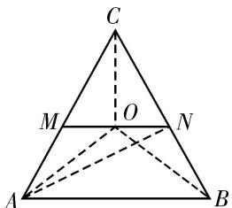

> [!faq]- 教师版对点训练解析
>
> > [!success]- **【答案】** 详见解析
>
> > [!note]- **【分析】**
> > 本题未单列分析。
>
> > [!note]- **【解析】**
> > 答案 1 解析 如图，设 $AC$ 中点为 $M, BC$ 中点为 $N$ . 因为 $\overrightarrow{OA} + \overrightarrow{OC} + \overrightarrow{OB} + \overrightarrow{OC} = 0$ ，所以 $2\overrightarrow{OM} + 2\overrightarrow{ON} = 0$ ，所以 $\overrightarrow{OM} + \overrightarrow{ON} = 0$ ， $O$ 为中位线 $MN$ 的中点，所以 $S_{\triangle AOC} = \frac{1}{2} S_{\triangle ANC} = \frac{1}{2} \times \frac{1}{2} S_{\triangle ABC} = \frac{1}{4} \times 4 = 1$ .
> > 
> > 秒杀 根据奔驰定理得， $S_{\triangle OBC}:S_{\triangle OAC}:S_{\triangle OAB}=1:1:2$ ．因为 $S_{\triangle ABC}=4$ ，所以 $S_{\triangle AOC}=1$
