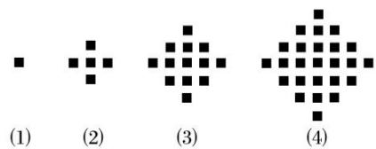

<!-- question-source:start -->
(6)某少数民族的刺绣有着悠久的历史，图
(1)，
(2)，
(3)，
(4)为最简单的四个图案，这些图案都由小正方形构成, 小正方形数越多刺绣越漂亮. 现按同样的规律刺绣(小正方形的摆放规律相同), 设第 $n$ 个图形包含 $f(n)$ 个小正方形, 则 $f
(6)=$ \_\_\_\_.

<!-- question-source:end -->

![[高中/总复习/专题/数列/专题01 数列的概念及性质-数列/考点01_由数列前几项求数列通项公式/例题/answers/Q00043845A1.md]]
