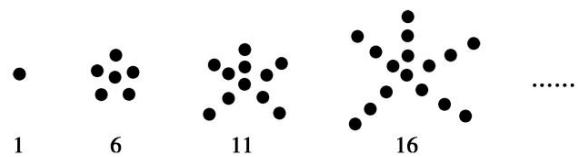

> [!faq]- 《专题01 数列的概念及性质-数列》例题解析
>
> > [!success]- **【答案】** C
>
> > [!note]- **【分析】**
> > 本题未单列分析。
>
> > [!note]- **【解析】**
> > 答案 $\sqrt{4n - 1}$ 解析 因为 $7 - 3 = 11 - 7 = 15 - 11 = 4$ ，即 $a_{n + 1}^2 - a_n^2 = 4$ ，所以 $a_n^2 = 3 + (n - 1) \times 4 = 4n - 1$ ，所以 $a_n = \sqrt{4n - 1}$ .
> > (2)数列 $-\frac{1}{1\times2},\frac{1}{2\times3},-\frac{1}{3\times4},\frac{1}{4\times5},\ldots$ 的一个通项公式 $a_{n}=$ \_\_\_\_.
> > 答案 $(-1)^n\frac{1}{n(n + 1)}$ 解析 这个数列前4项的绝对值都等于序号与序号加1的积的倒数，且奇数项为负，偶数项为正，所以它的一个通项公式为 $a_{n} = (-1)^{n}\frac{1}{n(n + 1)}.$
> > (3)已知数列 1, 2, $\sqrt{7}$ , $\sqrt{10}$ , $\sqrt{13}$ , ..., 则 $2\sqrt{19}$ 在这个数列中的项数是( )
> > A. 16    B. 24    C. 26    D. 28
> > 答案 C 解析 因为 $a_1 = 1 = \sqrt{1}$ , $a_2 = 2 = \sqrt{4}$ , $a_3 = \sqrt{7}$ , $a_4 = \sqrt{10}$ , $a_5 = \sqrt{13}$ , ..., 所以 $a_n = \sqrt{3n - 2}$ . 令 $a_n = \sqrt{3n - 2} = 2\sqrt{19} = \sqrt{76}$ , 解得 $n = 26$ .
> > (4)数列 $\frac{2}{3}$ ， $-\frac{4}{5}$ ， $\frac{6}{7}$ ， $-\frac{8}{9}$ ，…的第10项是( )
> > A. $-\frac{16}{17}$ B. $-\frac{18}{19}$ C. $-\frac{20}{21}$ D. $-\frac{22}{23}$
> > 答案 C 解析 所给数列呈现分数形式，且正负相间，求通项公式时，我们可以把每一部分进行分解：符号、分母、分子．很容易归纳出数列 $\{a_{n}\}$ 的通项公式 $a_{n}=(-1)^{n+1}\cdot\frac{2n}{2n+1}$ ，故 $a_{10}=-\frac{20}{21}$ .
> > (5)根据下面的图形及相应的点数，写出点数构成的数列的一个通项公式 $a_{n} =$ \_\_\_\_.
> > 
> > 答案 5n-4 解析 由 $a_{1}=1=5\times1-4,\quad a_{2}=6=5\times2-4,\quad a_{3}=11=5\times3-4,\quad \ldots$ ，归纳 $a_{n}=5n-4$ .
> > (6)某少数民族的刺绣有着悠久的历史，图(1)，(2)，(3)，(4)为最简单的四个图案，这些图案都由小正方形构成, 小正方形数越多刺绣越漂亮. 现按同样的规律刺绣(小正方形的摆放规律相同), 设第 $n$ 个图形包含 $f(n)$ 个小正方形, 则 $f(6)=$ \_\_\_\_.
> > 
> > 答案 61 解析 $f(1) = 1 = 2 \times 1 \times 0 + 1, f(2) = 1 + 3 + 1 = 2 \times 2 \times 1 + 1, f(3) = 1 + 3 + 5 + 3 + 1 = 2 \times 3 \times 2 + 1, f(4) = 1 + 3 + 5 + 7 + 5 + 3 + 1 = 2 \times 4 \times 3 + 1$ ，故 $f(n) = 2n(n - 1) + 1$ . 当 $n = 6$ 时， $f(6) = 2 \times 6 \times 5 + 1 = 61$ . 【对点精练】
