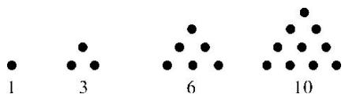
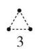
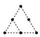
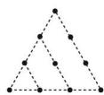
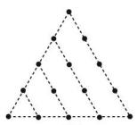

> [!faq]- 《专题01 数列的概念及性质-数列》例题解析
>
> > [!success]- **【答案】** C
>
> > [!note]- **【解析】**
> > 答案 $a_{n} = \frac{2(n - 1)}{2n - 1} (n\in \mathbf{N}^{*})$
> >
> > 2. 已知数列 $\{a_{n}\}$ 为 $\frac{1}{2}, \frac{1}{4}, -\frac{5}{8}, \frac{13}{16}, -\frac{29}{32}, \frac{61}{64}, \cdots$ ，则数列 $\{a_{n}\}$ 的一个通项公式是 \_\_\_\_.
> >
> > 2. 答案 $a_{n}=(-1)^{n}\cdot\frac{2^{n}-3}{2^{n}}$ 解析 各项的分母分别为 $2^{1}, 2^{2}, 2^{3}, 2^{4}, \cdots$ ，易看出从第 2 项起，每一项的分子都比分母少 3，且第 1 项可变为 $-\frac{2-3}{2}$ ，故原数列可变为 $-\frac{2^{1}-3}{2^{1}}, \frac{2^{2}-3}{2^{2}}, -\frac{2^{3}-3}{2^{3}}, \frac{2^{4}-3}{2^{4}}, \cdots$ ，故其通项公式可以为 $a_{n}=(-1)^{n}\cdot\frac{2^{n}-3}{2^{n}}$ .
> >
> > 3. 在数列 1, 1, 2, 3, 5, 8, 13, x, 34, 55, ... 中，x 应取( )
> > A. 19    B. 20    C. 21    D. 22
> >
> > 3. 答案 C 解析 $a_{1}=1,\quad a_{2}=1,\quad a_{3}=2,\quad \therefore a_{n+2}=a_{n+1}+a_{n},\quad \therefore x=8+13=21$ . 故选 C.
> >
> > 4. 已知数列 $\sqrt{2}, \sqrt{5}, 2\sqrt{2}, \ldots$ ，则 $2\sqrt{5}$ 是该数列的（）
> > A. 第5项    B. 第6项    C. 第7项    D. 第8项
> >
> > 4. 答案 C 解析 由数列 $\sqrt{2}, \sqrt{5}, 2\sqrt{2}, \ldots$ 的前三项 $\sqrt{2}, \sqrt{5}, \sqrt{8}$ 可知，数列的通项公式为 $a_{n} = \sqrt{2 + 3(n - 1)} = \sqrt{3n - 1}$ ，由 $\sqrt{3n - 1} = 2\sqrt{5}$ ，可得 $n = 7$ 。故选 C.
> >
> > 5. 传说古希腊毕达哥拉斯学派的数学家经常在沙滩上面画点或用小石子表示数。他们研究过如图所示的三角形数：
> >
> > 
> >
> > 将三角形数 1, 3, 6, 10, …记为数列 $\{a_{n}\}$ ，则数列 $\{a_{n}\}$ 的通项公式为 \_\_\_\_.
> >
> > 5. 答案 $a_{n}=\frac{n(n+1)}{2}$ 解析 由图可知 $a_{n+1}-a_{n}=n+1,\quad a_{1}=1$ ，由累加法可得 $a_{n}=\frac{n(n+1)}{2}$ .
> >
> > 6. 把 1, 3, 6, 10, 15, …这些数叫做三角形数，这是因为这些数目的圆点可以排成一个正三角形(如图所示).
> >
> > 15  
> > 
> >
> > 
> >
> > 
> >
> > 
> >
> > 则第7个三角形数是( )
> >
> > A. 27 B. 28 C. 29 D. 30
> >
> > 6. 答案 B 解析 观察三角形数的增长规律，可以发现每一项比它的前一项多的点数正好是该项的序号，即 $a_{n} = a_{n - 1} + n(n \geq 2)$ 。所以第7个三角形数是 $a_{7} = a_{6} + 7 = a_{5} + 6 + 7 = 15 + 6 + 7 = 28$ 。
> >
> > 故选 **B**.
