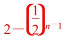

<!-- question-source:start -->
(1) 在数列 $\{a_{n}\}$ 中， $a_{1}=1,\quad a_{n+1}=\frac{1}{2}a_{n}+1$ ，则数列 $\{a_{n}\}$ 的通项公式为 \_\_\_\_.

<!-- question-source:end -->

![[高中/总复习/专题/数列/专题05 用构造辅助数列通项公式-数列/考点01_由__a__n___1____Aa_n___B_A_neq_0__且__A_neq_1_____B_neq_0___求__a__n___型/例题/answers/Q00043920A1.md]]
