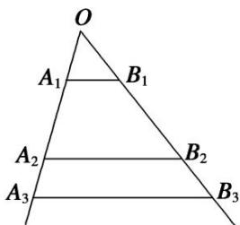

<!-- question-source:start -->
4. (2013·安徽)如图, 互不相同的点 $A_{1}, A_{2}, \cdots, A_{n}, \cdots$ 和 $B_{1}, B_{2}, \cdots, B_{n} \cdots$ 分别在角 $O$ 的两条边上, 所有 $A_{n} B_{n}$ 相互平行, 且所有梯形 $A_{n} B_{n} B_{n+1} A_{n+1}$ 的面积均相等. 设 $OA_{n} = a_{n}$ , 若 $a_{1} = 1$ , $a_{2} = 2$ , 则数列 $\{a_{n}\}$ 的通项公式是 \_\_\_\_.

<!-- question-source:end -->

![[高中/总复习/专题/数列/专题05 用构造辅助数列通项公式-数列/考点05_由其他形式的递推公式求__a__n___型/对点训练/answers/Q00036974A1.md]]
