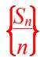

<!-- question-source:start -->
[例 4] (1) 已知 $S_{n}$ 是等差数列 $\{a_{n}\}$ 的前 n 项和，若 $a_{1} = -2020, \frac{S_{2022}}{2022} - \frac{S_{2016}}{2016} = 6$ ，则 $S_{2022} =$ \_\_\_\_ .

<!-- question-source:end -->

![[高中/总复习/专题/数列/专题07 等差数列的性质及应用-数列/考点03_性质_6_的应用/例题/answers/Q00037226A1.md]]
