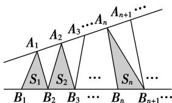

<!-- question-source:start -->
(6)如图，点列 $\{A_{n}\}$ ， $\{B_{n}\}$ 分别在某锐角的两边上，且 $|A_{n}A_{n + 1}| = |A_{n + 1}A_{n + 2}|$ ， $A_{n} \neq A_{n + 2}$ ， $n \in \mathbb{N}^{*}$ ， $|B_{n}B_{n + 1}| = |B_{n + 1}B_{n + 2}|$ ， $B_{n} \neq B_{n + 2}$ ， $n \in \mathbb{N}^{*}(P \neq Q$ 表示点 $P$ 与 $Q$ 不重合）。若 $d_{n} = |A_{n}B_{n}|$ ， $S_{n}$ 为 $\triangle A_{n}B_{n}B_{n + 1}$ 的面积，则（）

A. $\{S_n\}$ 是等差数列 B. $\{S_n^2\}$ 是等差数列 C. $\{d_n\}$ 是等差数列 D. $\{d_n^2\}$ 是等差数列
<!-- question-source:end -->

![[高中/总复习/专题/数列/专题08 等差数列的判定与证明-数列/专题08_等差数列的判定与证明/例题/answers/Q00043995A1.md]]
