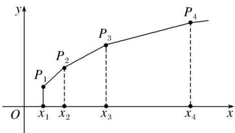

> [!faq]- 《专题14 错位相减法求和-数列》例题解析
>
> > [!success]- **【答案】** 详见解析
>
> > [!note]- **【分析】**
> > 本题未单列分析。
>
> > [!note]- **【解析】**
> > (1)求数列 $\{x_{n}\}$ 的通项公式;
> > (2)如图，在平面直角坐标系 xOy 中，依次连接点 $P_{1}(x_{1}, 1)$ ， $P_{2}(x_{2}, 2)$ ，…， $P_{n+1}(x_{n+1}, n+1)$ 得到折线 $P_{1}P_{2}\cdots P_{n+1}$ ，求由该折线与直线 y=0， $x=x_{1}$ ， $x=x_{n+1}$ 所围成的区域的面积 $T_{n}$ .
> > 
> > 解析 (1)设数列 $\{x_{n}\}$ 的公比为 $q$ 。由题意得 $\left\{\begin{array}{l} x_{1} + x_{1}q = 3, \\ x_{1}q^{2} - x_{1}q = 2. \end{array}\right.$ 所以 $3q^{2} - 5q - 2 = 0$
> > 由已知得 q>0，所以 q=2， $x_{1}=1$ ．因此数列 $\{x_{n}\}$ 的通项公式为 $x_{n}=2^{n-1}(n\in\mathbf{N}^{*})$ .
> > (2) 过 $P_{1}$ ， $P_{2}$ ，…， $P_{n+1}$ 向 x 轴作垂线，垂足分别为 $Q_{1}$ ， $Q_{2}$ ，…， $Q_{n+1}$ .
> > 由(1)得 $x_{n+1}-x_{n}=2^{n}-2^{n-1}=2^{n-1}$ ，记梯形 $P_{n}P_{n+1}Q_{n+1}Q_{n}$ 的面积为 $b_{n}$ ,
> > 由题意得 $b_{n} = \frac{(n + n + 1)}{2}\times 2^{n - 1} = (2n + 1)\times 2^{n - 2},$
> > 所以 $T_{n}=b_{1}+b_{2}+\cdots+b_{n}=3\times2^{-1}+5\times2^{0}+7\times2^{1}+\cdots+(2n-1)\times2^{n-3}+(2n+1)\times2^{n-2}.$ ①
> > 又 $2T_{n}=3\times2^{0}+5\times2^{1}+7\times2^{2}+\cdots+(2n-1)\times2^{n-2}+(2n+1)\times2^{n-1},$ ②
> > - **①**：-②得 $-T_{n}=3\times2^{-1}+(2+2^{2}+\cdots+2^{n-1})-(2n+1)\times2^{n-1}=\frac{3}{2}+\frac{2(1-2^{n-1})}{1-2}-(2n+1)\times2^{n-1}$ .
> > 所以 $T_{n}=\frac{(2n-1)\times2^{n}+1}{2}(n\in\mathbf{N}^{*})$ .
> > ## 【对点精练】
