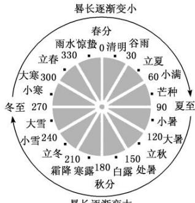
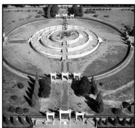

> [!faq]- 《专题22 数列中的数学文化问题-数列》例题解析
>
> > [!success]- **【答案】** B
>
> > [!note]- **【分析】**
> > 本题未单列分析。
>
> > [!note]- **【解析】**
> > 答案 D 解析 设等差数列 $\{a_{n}\}$ 的首项为 $a_1$ ，公差为 $d$ ，依题意有 $\left\{ \begin{array}{l} 2a_1 + d = 3a_1 + 9d, \\ 2a_1 + d = \frac{5}{2}, \end{array} \right.$ 解得 $\left\{ \begin{array}{l} a_1 = \frac{4}{3}, \\ d = -\frac{1}{6}, \end{array} \right.$ 即甲得 $\frac{4}{3}$ 钱，故选 D.
> > (2)《莱因德纸草书》是世界上最古老的数学著作之一，书中有一道这样的题目：把100个面包分给5个人，使每个人所得成等差数列，且使较大的三份之和的 $\frac{1}{7}$ 是较小的两份之和，问最小的一份为( )
> > A. $\frac{5}{3}$ B. $\frac{10}{3}$ C. $\frac{5}{6}$ D. $\frac{11}{6}$
> > 答案 A 解析 由 100 个面包分给 5 个人，每个人所得成等差数列，可知中间一人得 20 块面包，设较大的两份为 $20 + d, 20 + 2d$ ，较小的两份为 20 - d, 20 - 2d，由已知条件可得 $\frac{1}{7}(20 + 20 + d + 20 + 2d) = 20 - d + 20 - 2d$ ，解得 $d = \frac{55}{6}$ ，所以最小的一份为 $20 - 2d = 20 - 2 \times \frac{55}{6} = \frac{5}{3}$ .
> > (3)(多选)我国天文学和数学著作《周髀算经》中记载: 一年有二十四个节气, 每个节气的晷长损益相同(晷是按照日影测定时刻的仪器, 暑长即为所测量影子的长度). 二十四节气及晷长变化如图所示, 相邻两个节气晷长减少或增加的量相同, 周而复始. 已知每年冬至的晷长为一丈三尺五寸, 夏至的晷长为一尺五寸(一丈等于十尺, 一尺等于十寸), 则下列选项正确的有()
> > 
> > A. 相邻两个节气晷长减少或增加的量为一尺
> > B. 春分和秋分两个节气的晷长相同
> > C. 立冬的晷长为一丈五寸
> > D. 立春的晷长比立秋的晷长短
> > 答案 ABC 解析 由题意可知夏至到冬至的晷长构成等差数列 $\{a_{n}\}$ ，其中 $a_{1}=15$ 寸， $a_{13}=135$ 寸，公差为 d 寸，则 $135=15+12d$ ，解得 d=10 寸，同理可知由冬至到夏至的晷长构成等差数列 $\{b_{n}\}$ ，首项 $b_{1}=135$ ，末项 $b_{13}=15$ ，公差 d=-10（单位都为寸）。故 A 正确；∵春分的晷长为 $b_{7}$ ，∴ $b_{7}=b_{1}+6d=135-60=75$ ，∵秋分的晷长为 $a_{7}$ ，∴ $a_{7}=a_{1}+6d=15+60=75$ ，故 B 正确；∵立冬的晷长为 $a_{10}$ ，∴ $a_{10}=a_{1}+9d=15+90=105$ ，即立冬的晷长为一丈五寸，故 C 正确；∵立春的晷长，立秋的晷长分别为 $b_{4}$ ， $a_{4}$ ，∴ $a_{4}=a_{1}+3d=15+30=45$ ， $b_{4}=b_{1}+3d=135-30=105$ ，∴ $b_{4}>a_{4}$ ，故 D 错误。故选 A、B、C。
> > (4)《张丘建算经》卷上第22题为：“今有女善织，日益功疾。初日织五尺，今一月日织九匹三丈。”其意思为今有一女子擅长织布，且从第2天起，每天比前一天多织相同量的布，若第一天织5尺布，现在一个月(按30天计)共织390尺布。则该女子最后一天织布的尺数为( )
> > A. 18
> > B. 20
> > C. 21
> > D. 25
> > 答案 C 解析 依题意得，该女子每天所织的布的尺数依次排列形成一个等差数列，设为 $\{a_{n}\}$ ，其中 $a_{1} = 5$ ，前30项和为390，于是有 $\frac{30(5 + a_{30})}{2} = 390$ ，解得 $a_{30} = 21$ ，即该女子最后一天织21尺布.
> > (5)(2020·全国Ⅱ)北京天坛的圜丘坛为古代祭天的场所, 分上、中、下三层. 上层中心有一块圆形石板(称为天心石), 环绕天心石砌 9 块扇面形石板构成第一环, 向外每环依次增加 9 块. 下一层的第一环比上一层的最后一环多 9 块, 向外每环依次也增加 9 块. 已知每层环数相同, 且下层比中层多 729 块, 则三层共有扇面形石板(不含天心石)( )
> > 
> > A.3699块 B.3474块 C.3402块 D.3339块
> > 答案 C 解析 由题意知，由天心石开始向外的每环的扇面形石板块数构成一个等差数列，记为 $\{a_{n}\}$ ，易知其首项 $a_{1} = 9$ ，公差 $d = 9$ ，所以 $a_{n} = a_{1} + (n - 1)d = 9n$ 。设数列 $\{a_{n}\}$ 的前 $n$ 项和为 $S_{n}$ ，由等差数列的性质知 $S_{n}$ ， $S_{2n} - S_{n}$ ， $S_{3n} - S_{2n}$ 也成等差数列，所以 $2(S_{2n} - S_{n}) = S_{n} + S_{3n} - S_{2n}$ ，所以 $(S_{3n} - S_{2n}) - (S_{2n} - S_{n}) = S_{2n} - 2S_{n} = \frac{2n(9 + 18n)}{2} - 2 \times \frac{n(9 + 9n)}{2} = 9n^{2} = 729$ ，得 $n = 9$ ，所以三层共有扇面形石板的块数为 $S_{3n} = \frac{3n(9 + 27n)}{2} =$
> > $\frac{3\times9\times(9+27\times9)}{2}=3\ 402$ ，故选 C.
> > (6)(多选)大衍数列来源于《乾坤谱》中对易传“大衍之数五十”的推论。主要用于解释中国传统文化中的太极衍生原理。数列中的每一项，都代表太极衍生过程中曾经经历过的两仪数量总和，是中国传统文化中隐藏着的世界数学史上第一道数列题。其前10项依次是0，2，4，8，12，18，24，32，40，50，…，则下列说法正确的是( )
> > A. 此数列的第20项是200
> > B. 此数列的第19项是200
> > C. 此数列偶数项的通项公式为 $a_{2n}=2n^{2}$ D. 此数列的前n项和为 $S_{n}=n(n-1)$
> > 答案 AC 解析 观察此数列，偶数项通项公式为 $a_{2n} = 2n^2$ ，奇数项是后一项减去后一项的项数， $a_{2n - 1} = a_{2n} - 2n$ ，由此可得 $a_{20} = 2 \times 10^{2} = 200$ ，A 正确，C 正确； $a_{19} = a_{20} - 20 = 180$ ，B 错误； $S_{n} = n(n - 1) = n^{2} - n$ 是一个等差数列的前 $n$ 项和，而题中数列不是等差数列，不可能有 $S_{n} = n(n - 1)$ ，D 错误．故选 A、C.
> > ## 【对点精练】
> > 1. 《九章算术》“竹九节”问题: 现有一根9节的竹子, 自上而下各节的容积成等差数列. 上面4节的容积共为3升, 下面3节的容积共4升, 则第5节的容积为\_\_\_\_升.
> > 1. 答案 $\frac{67}{66}$ 解析 设该数列 $\{a_n\}$ 的首项为 $a_1$ ，公差为 $d$ ，依题意 $\left\{ \begin{array}{l} a_1 + a_2 + a_3 + a_4 = 3, \\ a_7 + a_8 + a_9 = 4, \end{array} \right.$ 即 $\left\{ \begin{array}{l} 4a_1 + 6d = 3, \\ 3a_1 + 21d = 4, \end{array} \right.$ 解得 $\left\{ \begin{array}{l} a_1 = \frac{13}{22}, \\ d = \frac{7}{66}, \end{array} \right.$ 则 $a_5 = a_1 + 4d = \frac{13}{22} + 4 \times \frac{7}{66} = \frac{67}{66}$ .
> > 2. “珠算之父”程大位是我国明代著名的数学家, 他的应用巨著《算法统宗》中有一首 “竹筒容米” 问题: “家有九节竹一茎, 为因盛米不均平, 下头三节六升六, 上梢四节四升四, 唯有中间两节竹, 要将米数次第盛, 若有先生能算法, 也教算得到天明.” ([注]六升六: 6.6 升, 次第盛: 盛米容积依次相差同一数量)用你所学的数学知识求得中间两节竹的容积为( )
> > A. 3.4 升
> > B. 2.4 升
> > C. 2.3 升
> > D. 3.6 升
> > 2. 答案 A 解析 设从下至上各节容积分别为 $a_{1}, a_{2}, \cdots, a_{9}$ 为等差数列，公差 d，则由题意可知， $\left\{\begin{aligned}&a_{1}+a_{2}+a_{3}=6.6,\\ &a_{6}+a_{7}+a_{8}+a_{9}=4.4,\end{aligned}\right.$ 故 $\left\{\begin{aligned}&3a_{1}+3d=6.6,\\ &4a_{1}+26d=4.4,\end{aligned}\right.$ 解得，d=-0.2, $a_{1}=2.4$ ，所以中间节 $a_{4}+a_{5}=1.8+1.6=3.4$ 。故选 A.
> > 3. “中国剩余定理”又称“孙子定理”。1852年，英国来华传教士伟烈亚力将《孙子算经》中“物不知数”问题的解法传至欧洲。1874年，英国数学家马西森指出此法符合1801年由高斯得到的关于同余式解法的一般性定理，因而西方称之为“中国剩余定理”。“中国剩余定理”讲的是一个关于整除的问题，现有这样一个整除问题：将1至2020这2020个数中，能被3除余1且被7除余1的数按从小到大的顺序排成一列，构成数列 $\{a_{n}\}$ ，则此数列共有( )
> > A. 98项
> > B. 97项
> > C. 96项
> > D. 95项
> > 3. 答案 B 解析 能被 3 除余 1 且被 7 除余 1 的数就只能是被 21 除余 1 的数，故 $a_{n} = 21n - 20$ ，由 $1 \leq a_{n} \leq 2020$ 得 $1 \leq n \leq 97\frac{3}{21}$ ，又 $n \in \mathbf{N}_{+}$ ，故此数列共有 97 项.
