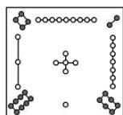
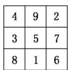

<!-- question-source:start -->
10. 我国古代的《洛书》中记载着世界上最古老的一个幻方(如图①所示). 将 1, 2, ..., 9 填入 $3 \times 3$ 的方格内(如图②所示), 使三行、三列及两条对角线上的三个数字之和都等于 15 , 这个方阵叫做 3 阶幻方. 一般地, 将连续的正整数 1, 2, 3, ..., $n^2$ 填入 $n \times n$ 的方格中, 使得每行、每列及两条对角线上的数字之和都相等, 这个方阵叫做 $n(n \geq 3)$ 阶幻方. 记 $n$ 阶幻方的对角线上的数的和为 $N_n$ , 如 $N_3 = 15$ , 那么 $N_9 = (\quad)$

  
①

  
②

A. 41 B. 45 C. 369 D. 321
<!-- question-source:end -->

![[高中/总复习/专题/数列/专题22 数列中的数学文化问题-数列/考点01_等差数列型/对点训练/answers/Q00037368A1.md]]
