<!-- question-source:start -->
[例 1] 下图是一些标准几何体的三视图，写出其直观图的名称.

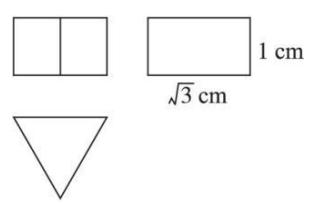

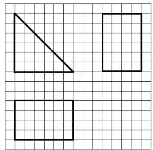

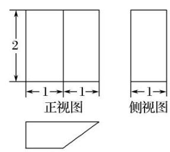

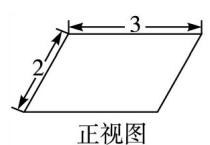

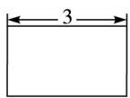

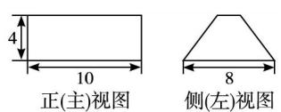

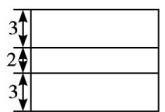

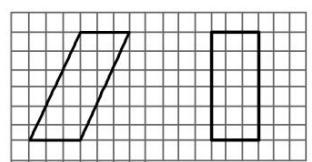  
侧(左)视图  
俯视图

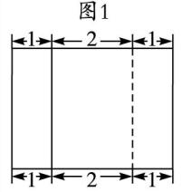  
侧视图
图2

图3  
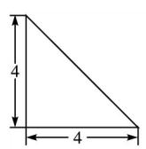  
正(主)视图

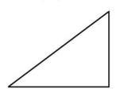  
俯视图

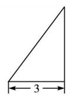  
侧(左)视图

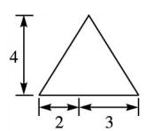

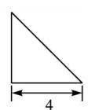

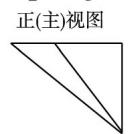  
侧(左)视图

俯视图  
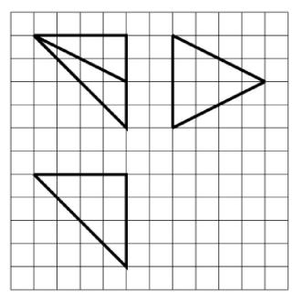

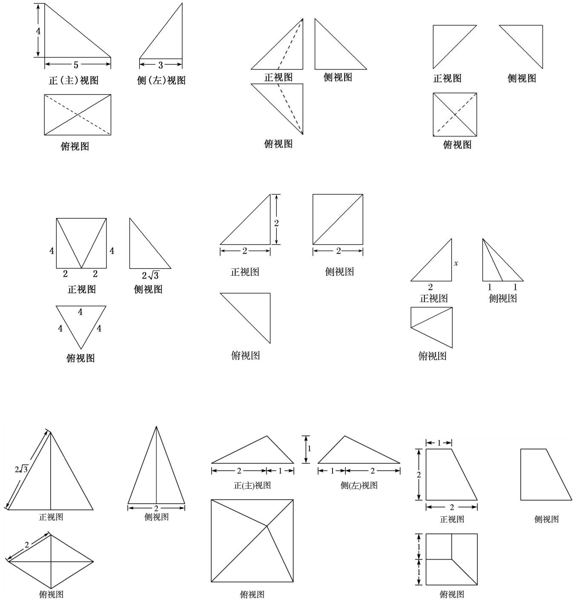

[解析] 直三棱柱 直三棱柱 直四棱柱 直四棱柱 斜四棱柱 斜四棱柱 三棱锥 三棱锥 三棱

锥 三棱锥 三棱锥 三棱锥 四棱锥 四棱锥 四棱锥 四棱锥 四棱锥 四棱台.

## 二 锥体几何体还原

锥体几何体还原口诀(六线诀)

点点线线断底面，定长锁高宽相连，双线汇交寻阵眼，返璞归真显在前.

## 【例题选讲】
<!-- question-source:end -->
