<!-- question-source:start -->
[例 3]
(1)某几何体的三视图如图所示，则该几何体的体积为( )

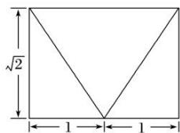  
正(主)视图

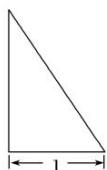  
侧(左)视图

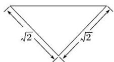  
俯视图

A. $\frac{\sqrt{2}}{3}$ B. $\frac{2\sqrt{2}}{3}$ C. $\sqrt{2}$ D. $2\sqrt{2}$

(2)一个四面体的三视图如图所示，则该四面体的体积是()

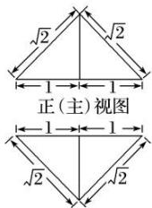

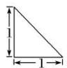  
侧(左)视图  
俯视图

A. $\frac{1}{2}$ B. $\frac{1}{3}$ C. $\frac{2}{3}$ D. 1

(3)(2017·北京)某三棱锥的三视图如图所示，则该三棱锥的体积为()

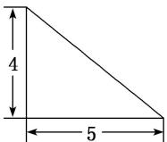  
正(主)视图

  
侧(左)视图

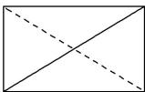  
俯视图

A. 60 B. 30 C. 20 D. 10

(4)(2018·福州四校联考)已知某几何体的三视图如图所示，则该几何体的表面积为()

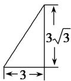  
正视图

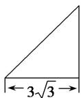  
侧视图

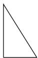  
俯视图

A. $\frac{27}{2}$ B. 27 C. $27\sqrt{2}$ D. $27\sqrt{3}$

(5)某四棱锥的三视图如图所示，则该四棱锥的侧面积是()

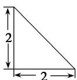  
正视图

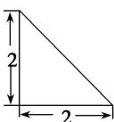  
侧视图

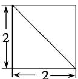  
俯视图

A. $4 + 4\sqrt{2}$ B. $4\sqrt{2} + 2$ C. $8 + 4\sqrt{2}$ D. $\frac{8}{3}$

(6)某几何体的三视图如图所示，则该几何体中，面积最大的侧面的面积为\_\_\_\_。

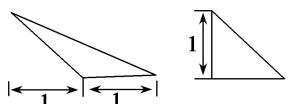  
正（主）视图侧（左）视图

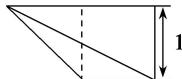  
俯视图
<!-- question-source:end -->

![[高中/总复习/专题/立体几何/专题01 关于3视图还原几何体的深度剖析与秒杀-立体几何（文理通用）/专题01_关于3视图还原几何体的深度剖析与秒杀/例题/answers/Q00043496A1.md]]
