<!-- question-source:start -->
[例 4]
(1)(2017·全国 I) 某多面体的三视图如图所示，其中正视图和左视图都由正方形和等腰直角三角形组成，正方形的边长为 2，俯视图为等腰直角三角形．该多面体的各个面中有若干个是梯形，这些梯形的面积之和为( )

A. 10 B. 12 C. 14 D. 16

(2)(2016·全国Ⅱ)如图是由圆柱与圆锥组合而成的几何体的三视图，则该几何体的表面积为()

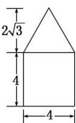

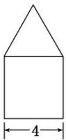

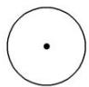

A. $20\pi$ B. $24\pi$ C. $28\pi$ D. $32\pi$

(3)某几何体的三视图如图所示，三个视图中的曲线都是圆弧，则该几何体的体积为( )

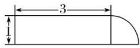

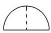

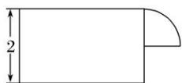

A. $\frac{4\pi}{3}$ B. $\frac{5\pi}{3}$ C. $\frac{7\pi}{6}$ D. $\frac{11\pi}{6}$

(4)(2017·山东)由一个长方体和两个 $\frac{1}{4}$ 圆柱构成的几何体的三视图如图, 则该几何体的体积为\_\_\_\_.

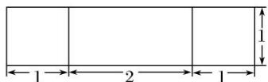  
正视图

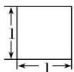  
侧视图

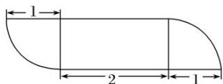  
俯视图

(5)(2017·浙江)某几何体的三视图如图所示(单位: cm)，则该几何体的体积(单位: cm³)是()

  
正视图

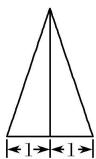  
侧视图

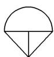  
俯视图

A. $\frac{\pi}{2} + 1$ B. $\frac{\pi}{2} + 3$ C. $\frac{3\pi}{2} + 1$ D. $\frac{3\pi}{2} + 3$

(6)某几何体的三视图如图所示，则该几何体的体积是()

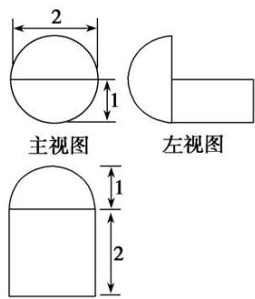  
俯视图

A. $\frac{4\pi}{3}$ B. $\frac{5\pi}{3}$ C. $2 + \frac{2\pi}{3}$ D. $4 + \frac{2\pi}{3}$

[解析]
(1)答案 B 由三视图可知该多面体是一个组合体，下面是一个底面是等腰直角三角形的直三棱柱，上面是一个底面是等腰直角三角形的三棱锥，等腰直角三角形的腰长为2，直三棱柱的高为2，三棱锥的高为2，易知该多面体有2个面是梯形，这些梯形的面积之和为 $\frac{(2+4)\times2}{2}\times2=12$ ，故选B.

(2)答案 C 由三视图知该几何体是圆锥与圆柱的组合体，设圆柱底面圆半径为 r，周长为 c，圆锥母线长为 l，圆柱高为 h。由图得 r=2， $c=2\pi r=4\pi$ ，h=4，由勾股定理得： $l=\sqrt{2^{2}+(2\sqrt{3})^{2}}=4$ ， $S_{表}=\pi r^{2}+ch+\frac{1}{2}cl=4\pi+16\pi+8\pi=28\pi$ 。故选 C。

(3)答案 B 由三视图可知，该几何体是由半个圆柱与 $\frac{1}{8}$ 个球组成的组合体，其体积为 $\frac{1}{2} \times \pi \times 1^2 \times 3 + \frac{1}{8} \times \frac{4\pi}{3} \times 1^3 = \frac{5\pi}{3}$ .

(4)答案 $2 + \frac{\pi}{2}$ 该几何体由一个长、宽、高分别为2，1，1的长方体和两个半径为1，高为1的 $\frac{1}{4}$ 圆柱体构成．所以 $V = 2\times 1\times 1 + 2\times \frac{1}{4}\times \pi \times 1^2\times 1 = 2 + \frac{\pi}{2}.$

(5)答案 A 由三视图可知，该几何体是半个圆锥和一个三棱锥的组合体，半圆锥的底面半径为1，高为3，三棱锥的底面积为 $\frac{1}{2}\times2\times1=1$ ，高为3．故原几何体体积为： $V=\frac{1}{2}\times\pi\times1^{2}\times3\times\frac{1}{3}+1\times3\times\frac{1}{3}=\frac{\pi}{2}+1$ ．故选A.

(6)答案 B 由三视图可知，该几何体为一个半径为 1 的半球与一个底面半径为 1，高为 2 的半圆柱组合而成的组合体，故其体积 $V=\frac{2}{3}\pi\times1^{3}+\frac{1}{2}\pi\times1^{2}\times2=\frac{5}{3}\pi$ ，故选 B.

## 【对点训练】
<!-- question-source:end -->
