<!-- question-source:start -->
[例 5]
(1)(2015·全国Ⅱ)一个正方体被一个平面截去一部分后，剩余部分的三视图如下图，则截去部分体积与剩余部分体积的比值为()

  
正(主)视图

  
侧(左)视图

  
俯视图

A. $\frac{1}{8}$ B. $\frac{1}{7}$ C. $\frac{1}{6}$ D. $\frac{1}{5}$

(2)如图是某几何体的三视图，则该几何体的外接球的表面积为( )

正视图  
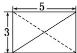  
正视图

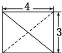

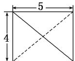  
侧视图  
俯视图

A. $200\pi$ B. $150\pi$ C. $100\pi$ D. $50\pi$

(3)如图, 网格纸上小正方形的边长为 1 , 下图画出的是某几何体的三视图, 则该几何体的表面积为 ( )

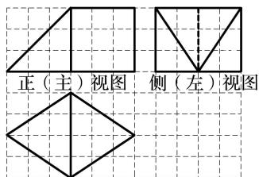  
俯视图

A. $12\sqrt{13} + 6\sqrt{2} + 18$ B. $9\sqrt{13} + 6\sqrt{2} + 18$ C. $9\sqrt{13} + 8\sqrt{2} + 18$ D. $9\sqrt{13} + 6\sqrt{2} + 12$

(4)如图是某几何体的三视图，则该几何体的体积为( )

A. 12    B. 15    C. 18    D. 21

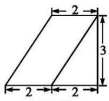

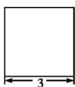

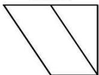  
侧视图  
俯视图

(5)(2017·全国Ⅱ)如图，网格纸上小正方形的边长为1，粗实线画出的是某几何体的三视图，该几何体由一平面将一圆柱截去一部分后所得，则该几何体的体积为()

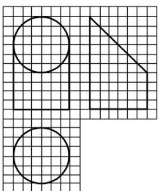

A. $90\pi$ B. $63\pi$ C. $42\pi$ D. $36\pi$

(6)如图是一个空间几何体的正视图和俯视图，则它的侧视图为( )

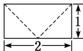  
正视图

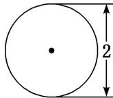  
俯视图

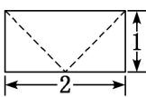  
A

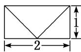  
B

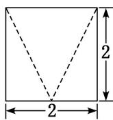  
C

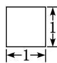  
D
<!-- question-source:end -->

![[高中/总复习/专题/立体几何/专题01 关于3视图还原几何体的深度剖析与秒杀-立体几何（文理通用）/专题01_关于3视图还原几何体的深度剖析与秒杀/例题/answers/Q00043498A1.md]]
