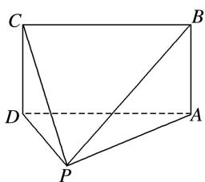
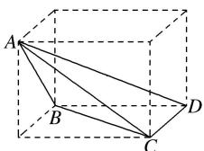
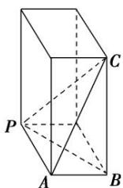
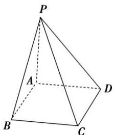
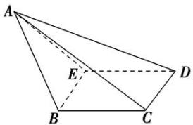

> [!faq]- 《专题01 关于3视图还原几何体的深度剖析与秒杀-立体几何（文理通用）》例题解析
>
> > [!success]- **【答案】** B
>
> > [!note]- **【解析】**
> > [解析]
> > (1)答案 B 题中三视图表示的几何体如图所示，其中 $\triangle PAD$ 为等腰直角三角形，平面 $PAD \perp$ 平面 $ABCD$ ，四边形 $ABCD$ 为矩形且面积为 $2\sqrt{2}$ ，点 $P$ 到平面 $ABCD$ 的距离为 1 ，故体积为 $\frac{1}{3} \times 1 \times 2\sqrt{2} = \frac{2\sqrt{2}}{3}$ ，故选 B.
> >
> > 
> >
> > (2)答案 B 根据题意得到原四面体是底面为等腰直角三角形,高为 1 的三棱锥,故得到体积为 $\frac{1}{3} \times \frac{1}{2} \times 2 \times 1 \times 1 = \frac{1}{3}$ . 故选 B.
> >
> > (3)答案 D 如图，把三棱锥 A-BCD 放到长方体中，长方体的长、宽、高分别为 5,3,4， $\triangle BCD$ 为直角三角形，直角边分别为 5 和 3，三棱锥 A-BCD 的高为 4，故该三棱锥的体积 $V=\frac{1}{3}\times\frac{1}{2}\times5\times3\times4=10$ 。故选 D.
> >
> > 
> >
> > (4)答案 D 在长、宽、高分别为 $3\sqrt{3}$ , 3, $3\sqrt{3}$ 的长方体中, 由几何体的三视图得几何体为如图所示的三棱锥 $C - BAP$ , 其中底面 $BAP$ 是 $\angle BAP = 90^{\circ}$ 的直角三角形, $AB = 3$ , $AP = 3\sqrt{3}$ , 所以 $BP = 6$ , 又棱 $CB \perp$ 平面 $BAP$ 且 $CB = 3\sqrt{3}$ , 所以 $AC = 6$ , 所以该几何体的表面积是 $\frac{1}{2} \times 3 \times 3\sqrt{3} + \frac{1}{2} \times 3 \times 3\sqrt{3} + \frac{1}{2} \times 6 \times 3\sqrt{3} + \frac{1}{2} \times 6 \times 3\sqrt{3} = 27\sqrt{3}$ , 故选 D.
> >
> > 
> >
> > (5)答案 A 由三视图可知该几何体是一个四棱锥，记为四棱锥 P-ABCD，如图所示，其中 $PA \perp$ 底面 ABCD，四边形 ABCD 是正方形，且 PA=2, AB=2, $PB=2\sqrt{2}$ ，所以该四棱锥的侧面积 S 是四个直角三角形的面积和，即 $S=2\times(\frac{1}{2}\times2\times2+\frac{1}{2}\times2\times2\sqrt{2})=4+4\sqrt{2}$ ，故选 A.
> >
> > 
> >
> > (6)答案 $\frac{\sqrt{5}}{2}$ 由三视图可知，几何体的直观图如图所示，平面 $AED \perp$ 平面 $BCDE$ ，四棱锥 $ABCDE$ 的高为1，四边形 $BCDE$ 是边长为1的正方形，则 $S_{\triangle ABC} = S_{\triangle ABE} = \frac{1}{2} \times 1 \times \sqrt{2} = \frac{\sqrt{2}}{2}, S_{\triangle ADE} = \frac{1}{2}, S_{\triangle ACD} = \frac{1}{2} \times 1 \times \sqrt{5} = \frac{\sqrt{5}}{2}$ ，故面积最大的侧面的面积为 $\frac{\sqrt{5}}{2}$ .
> >
> > 
> >
> > ## 【对点训练】
