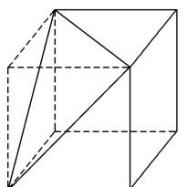
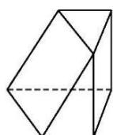

> [!faq]- 《专题01 关于3视图还原几何体的深度剖析与秒杀-立体几何（文理通用）》例题解析
>
> > [!success]- **【答案】** D
>
> > [!note]- **【解析】**
> > [解析]
> > (1)答案 D 由题意知该正方体截去了一个三棱锥，如图所示，设正方体棱长为 a，则 $V_{正方体}=a^{3}$ ， $V_{截去部分}=\frac{1}{6}a^{3}$ ，故截去部分体积与剩余部分体积的比值为 $\frac{1}{6}a^{3}:\frac{5}{6}a^{3}=1:5$ .
> >
> > 
> >
> > (2)答案 D 由三视图知，该几何体可以由一个长方体截去4个角后得到，此长方体的长、宽、高分别为5,4,3，所以外接球半径 $R$ 满足 $2R = \sqrt{4^2 + 3^2 + 5^2} = 5\sqrt{2}$ ，所以外接球的表面积为 $S = 4\pi R^2 = 4\pi \times \left(\frac{5\sqrt{2}}{2}\right)^2 = 50\pi$ ，故选D.
> >
> > (3)答案 B 作出该几何体的直观图如图所示(所作图形进行了一定角度的旋转)，故所求几何体的表面积 $S = 2 \times 3 \times \sqrt{13} + 2 \times \frac{1}{2} \times 3 \times \sqrt{13} + \frac{1}{2} \times 4 \times 6 + \frac{1}{2} \times 3 \times 4 + \frac{1}{2} \times 4 \times 3\sqrt{2} = 9\sqrt{13} + 6\sqrt{2} + 18$ ，故选 B.
> >
> > 
> >
> > (4)答案 C 由三视图可得该几何体是一个长、宽、高分别为 4, 3, 3 的长方体切去一半得到的, 其直观图如图所示. 其体积为 $\frac{1}{2} \times 4 \times 3 \times 3 = 18$ , 故选 C.
> >
> > 
> >
> > (5)答案 B 由题意知，该几何体由底面半径为 3，高为 10 的圆柱截去底面半径为 3，高为 6 的圆柱的一半所得，故其体积 $V = \pi \times 3^2 \times 10 - \frac{1}{2} \times \pi \times 3^2 \times 6 = 63\pi$ . 故选 B.
> >
> > (6)答案 A 由正视图和俯视图可知，该几何体是由一个圆柱挖去一个圆锥构成的，结合正视图的宽及俯视图的直径可知侧视图应为 A，故选 A.
> >
> > ## 【对点训练】
