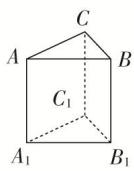
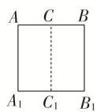
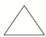

<!-- question-source:start -->
3. (2019·银川模拟)如图, 水平放置的三棱柱的侧棱长为 1 , 且侧棱 $AA_{1} \perp$ 平面 $A_{1}B_{1}C_{1}$ , 正视图是边长为 1 的正方形, 俯视图为一个等边三角形, 则该三棱柱的侧视图面积为( )

正视图  
  
俯视图

A. $2\sqrt{3}$ B. $\sqrt{3}$ C. $\frac{\sqrt{3}}{2}$ D. 1
<!-- question-source:end -->

![[高中/总复习/专题/立体几何/专题01 关于3视图还原几何体的深度剖析与秒杀-立体几何（文理通用）/专题01_关于3视图还原几何体的深度剖析与秒杀/对点训练/answers/Q00039440A1.md]]
