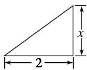
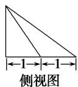
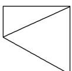

<!-- question-source:start -->
7. 某几何体的三视图如图所示, 且该几何体的体积是 $\frac{3}{2}$ , 则正视图中的 $x$ 是( )

  
俯视图

A. 2 B. 4.5 C. 1.5 D. 3
<!-- question-source:end -->

![[高中/总复习/专题/立体几何/专题01 关于3视图还原几何体的深度剖析与秒杀-立体几何（文理通用）/专题01_关于3视图还原几何体的深度剖析与秒杀/对点训练/answers/Q00039444A1.md]]
