<!-- question-source:start -->
11. (2019·南昌联考)已知底面为正方形的四棱锥，其一条侧棱垂直于底面，那么该四棱锥的三视图可能是下列各图中的( )

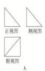

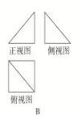

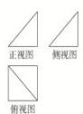

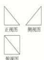

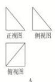

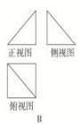

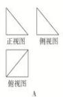

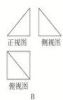

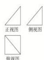

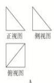

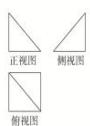

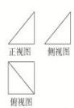

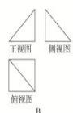

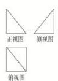

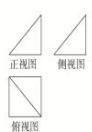

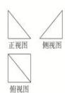
<!-- question-source:end -->

![[高中/总复习/专题/立体几何/专题01 关于3视图还原几何体的深度剖析与秒杀-立体几何（文理通用）/专题01_关于3视图还原几何体的深度剖析与秒杀/对点训练/answers/Q00039448A1.md]]
