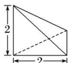
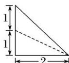
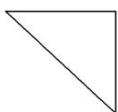

<!-- question-source:start -->
17. 某几何体的三视图如图所示，则该几何体外接球的表面积是( )

  
正(主)视图

  
侧(左)视图

  
俯视图

A. $8\pi$ B. $12\pi$ C. $16\pi$ D. $\frac{25\pi}{2}$
<!-- question-source:end -->

![[高中/总复习/专题/立体几何/专题01 关于3视图还原几何体的深度剖析与秒杀-立体几何（文理通用）/专题01_关于3视图还原几何体的深度剖析与秒杀/对点训练/answers/Q00039454A1.md]]
