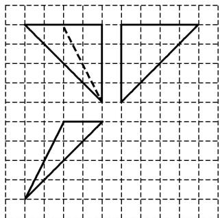

<!-- question-source:start -->
18. 如图, 网格上小正方形的边长为 1 , 粗线画出的是某个多面体的三视图, 若该多面体的所有顶点都在球 $O$ 的表面上, 则球 $O$ 的表面积是 ( )

A. $36\pi$ B. $48\pi$ C. $56\pi$ D. $64\pi$
<!-- question-source:end -->

![[高中/总复习/专题/立体几何/专题01 关于3视图还原几何体的深度剖析与秒杀-立体几何（文理通用）/专题01_关于3视图还原几何体的深度剖析与秒杀/对点训练/answers/Q00039455A1.md]]
