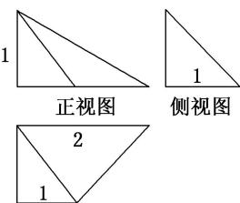

<!-- question-source:start -->
5. 一个几何体的三视图如图所示, 则该几何体的体积为( )

  
俯视图

A. 1 B. $\frac{3}{2}$ C. $\frac{1}{2}$ D. $\frac{3}{4}$
<!-- question-source:end -->

![[高中/总复习/专题/立体几何/专题01 关于3视图还原几何体的深度剖析与秒杀-立体几何（文理通用）/专题01_关于3视图还原几何体的深度剖析与秒杀/对点训练/answers/Q00039461A1.md]]
