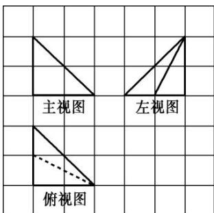

<!-- question-source:start -->
6. 如图, 网格纸上小正方形的边长为 1 , 粗实线及粗虚线画出的是某多面体的三视图, 则该多面体的体积为( )

A. $\frac{2}{3}$ B. $\frac{4}{3}$ C. 2 D. $\frac{8}{3}$
<!-- question-source:end -->

![[高中/总复习/专题/立体几何/专题01 关于3视图还原几何体的深度剖析与秒杀-立体几何（文理通用）/专题01_关于3视图还原几何体的深度剖析与秒杀/对点训练/answers/Q00039462A1.md]]
