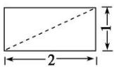
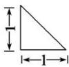
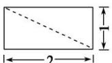

<!-- question-source:start -->
8. 某几何体的三视图如图所示，则该几何体的体积为( )

A. $\frac{1}{2}$ B. $\frac{\sqrt{2}}{2}$ C. $\frac{\sqrt{3}}{3}$ D. $\frac{2}{3}$

  
正视图

  
侧视图

  
俯视图
<!-- question-source:end -->

![[高中/总复习/专题/立体几何/专题01 关于3视图还原几何体的深度剖析与秒杀-立体几何（文理通用）/专题01_关于3视图还原几何体的深度剖析与秒杀/对点训练/answers/Q00039464A1.md]]
