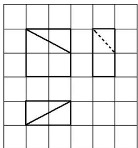

<!-- question-source:start -->
9. 如图, 网格纸上小正方形的边长为 1 , 粗线画的是一个几何体的三视图, 则该几何体的体积为( )

A. 3 B. $\frac{11}{3}$ C. 7 D. $\frac{23}{3}$
<!-- question-source:end -->

![[高中/总复习/专题/立体几何/专题01 关于3视图还原几何体的深度剖析与秒杀-立体几何（文理通用）/专题01_关于3视图还原几何体的深度剖析与秒杀/对点训练/answers/Q00039465A1.md]]
