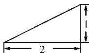
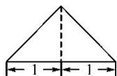
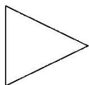

<!-- question-source:start -->
10. 某三棱锥的三视图如图所示，则该三棱锥的表面积是( )

正(主)视图  
  
侧(左)视图  
俯视图

A. $2 + \sqrt{5}$ B. $2 + 2\sqrt{5}$ C. $\frac{4}{3}$ D. $\frac{2}{3}$
<!-- question-source:end -->

![[高中/总复习/专题/立体几何/专题01 关于3视图还原几何体的深度剖析与秒杀-立体几何（文理通用）/专题01_关于3视图还原几何体的深度剖析与秒杀/对点训练/answers/Q00039466A1.md]]
