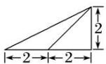
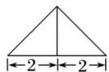
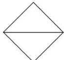

<!-- question-source:start -->
11. 一个几何体的三视图及其尺寸如图所示，则该几何体的表面积为( )

  
正视图

  
侧视图  
俯视图

A. 16 B. $8\sqrt{2} + 8$ C. $2\sqrt{2} + 2\sqrt{6} + 8$ D. $4\sqrt{2} + 4\sqrt{6} + 8$
<!-- question-source:end -->

![[高中/总复习/专题/立体几何/专题01 关于3视图还原几何体的深度剖析与秒杀-立体几何（文理通用）/专题01_关于3视图还原几何体的深度剖析与秒杀/对点训练/answers/Q00039467A1.md]]
