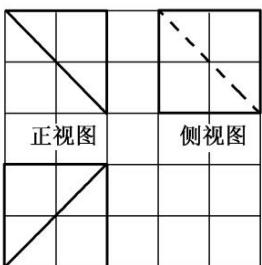

<!-- question-source:start -->
12. 如图, 网格纸上小正方形的边长为 1 , 粗线是一个棱锥的三视图, 则该棱锥的表面积为( )

  
俯视图

A. $6 + 4\sqrt{2} + 2\sqrt{3}$ B. $8 + 4\sqrt{2}$ C. $6 + 6\sqrt{2}$ D. $6 + 2\sqrt{2} + 4\sqrt{3}$
<!-- question-source:end -->

![[高中/总复习/专题/立体几何/专题01 关于3视图还原几何体的深度剖析与秒杀-立体几何（文理通用）/专题01_关于3视图还原几何体的深度剖析与秒杀/对点训练/answers/Q00039468A1.md]]
