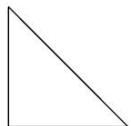
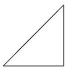
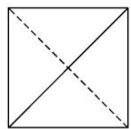

<!-- question-source:start -->
13. 某四面体的三视图如图所示, 正视图、侧视图都是腰长为 2 的等腰直角三角形, 俯视图是边长为 2 的

正方形，则此四面体的最大面的面积是( )

  
正视图

  
侧视图

  
俯视图

A. 2 B. $2\sqrt{2}$ C. $2\sqrt{3}$ D. 4
<!-- question-source:end -->

![[高中/总复习/专题/立体几何/专题01 关于3视图还原几何体的深度剖析与秒杀-立体几何（文理通用）/专题01_关于3视图还原几何体的深度剖析与秒杀/对点训练/answers/Q00039469A1.md]]
