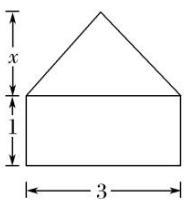
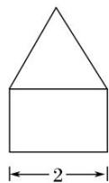
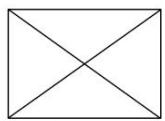

<!-- question-source:start -->
1. 如图是一个体积为 10 的空间几何体的三视图，则图中 $x$ 的值为( )

  
正视图

  
侧视图

  
俯视图

A. 2 B. 3 C. 4 D. 5
<!-- question-source:end -->

![[高中/总复习/专题/立体几何/专题01 关于3视图还原几何体的深度剖析与秒杀-立体几何（文理通用）/专题01_关于3视图还原几何体的深度剖析与秒杀/对点训练/answers/Q00039475A1.md]]
