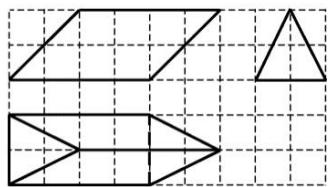

<!-- question-source:start -->
6. 如图, 网格纸上小正方形的边长为 1 , 粗线画出的是某几何体的三视图, 则该几何体的表面积为( )

A. $8 + 4\sqrt{2} + 8\sqrt{5}$ B. $24 + 4\sqrt{2}$ C. $8 + 20\sqrt{2}$ D. 28
<!-- question-source:end -->

![[高中/总复习/专题/立体几何/专题01 关于3视图还原几何体的深度剖析与秒杀-立体几何（文理通用）/专题01_关于3视图还原几何体的深度剖析与秒杀/对点训练/answers/Q00039480A1.md]]
