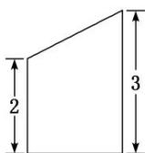
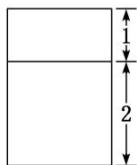
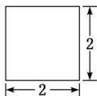

<!-- question-source:start -->
3. (2019·武汉部分学校调研)一个几何体的三视图如图所示, 则它的表面积为( )

  
正视图

  
侧视图  
俯视图

A. 28 B. $24 + 2\sqrt{5}$ C. $20 + 4\sqrt{5}$ D. $20 + 2\sqrt{5}$
<!-- question-source:end -->

![[高中/总复习/专题/立体几何/专题01 关于3视图还原几何体的深度剖析与秒杀-立体几何（文理通用）/专题01_关于3视图还原几何体的深度剖析与秒杀/对点训练/answers/Q00039489A1.md]]
