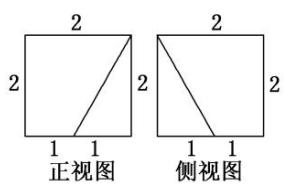
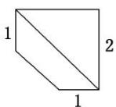

<!-- question-source:start -->
7. 已知一个棱长为 2 的正方体, 被一个平面截后所得几何体的三视图如图所示, 则该几何体的体积是 \_\_\_\_.

  
俯视图
<!-- question-source:end -->

![[高中/总复习/专题/立体几何/专题01 关于3视图还原几何体的深度剖析与秒杀-立体几何（文理通用）/专题01_关于3视图还原几何体的深度剖析与秒杀/对点训练/answers/Q00039493A1.md]]
