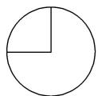
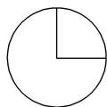
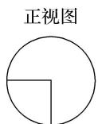

<!-- question-source:start -->
11. (2016·全国 I)如图, 某几何体的三视图是三个半径相等的圆及每个圆中两条互相垂直的半径. 若该几何体的体积是 $\frac{28\pi}{3}$ , 则它的表面积是( )

  
侧视图  
俯视图

A. $17\pi$ B. $18\pi$ C. $20\pi$ D. $28\pi$
<!-- question-source:end -->

![[高中/总复习/专题/立体几何/专题01 关于3视图还原几何体的深度剖析与秒杀-立体几何（文理通用）/专题01_关于3视图还原几何体的深度剖析与秒杀/对点训练/answers/Q00039497A1.md]]
