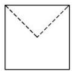
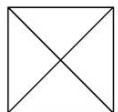

<!-- question-source:start -->
12. 某几何体的三视图如图所示，图中的四边形都是边长为 1 的正方形，其中正(主)视图、侧(左)视图中的

两条虚线互相垂直，则该几何体的体积是( )

  
正(主)视图

  
侧(左)视图

  
俯视图

A. $\frac{5}{6}$ B. $\frac{3}{4}$ C. $\frac{1}{2}$ D. $\frac{1}{6}$
<!-- question-source:end -->

![[高中/总复习/专题/立体几何/专题01 关于3视图还原几何体的深度剖析与秒杀-立体几何（文理通用）/专题01_关于3视图还原几何体的深度剖析与秒杀/对点训练/answers/Q00039498A1.md]]
