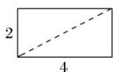
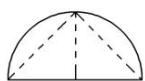
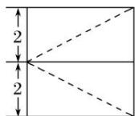

<!-- question-source:start -->
17. 某几何体的三视图如图所示, 则该几何体的体积为( )

  
4

A. $8\pi -\frac{16}{3}$ B. $4\pi -\frac{16}{3}$ C. $8\pi -4$ D. $4\pi +\frac{8}{3}$
<!-- question-source:end -->

![[高中/总复习/专题/立体几何/专题01 关于3视图还原几何体的深度剖析与秒杀-立体几何（文理通用）/专题01_关于3视图还原几何体的深度剖析与秒杀/对点训练/answers/Q00039503A1.md]]
