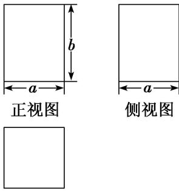

<!-- question-source:start -->
1. 已知某几何体的三视图如图所示，正视图和侧视图都是矩形，俯视图是正方形，在该几何体上任意选择4个顶点，以这4个点为顶点的几何体的形状给出下列命题：①矩形；②有三个面为直角三角形，有一个面为等腰三角形的四面体；③两个面都是等腰直角三角形的四面体。

  
俯视图

其中正确命题的序号是\_\_\_\_。
<!-- question-source:end -->

![[高中/总复习/专题/立体几何/专题01 关于3视图还原几何体的深度剖析与秒杀-立体几何（文理通用）/专题01_关于3视图还原几何体的深度剖析与秒杀/对点训练/answers/Q00050947A1.md]]
