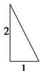
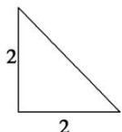
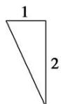

<!-- question-source:start -->
5. (2019·四川成都七中诊断)一个棱锥的三视图如图所示，则该棱锥的外接球的体积是( )

  
侧视图

正视图  
  
俯视图

A. $9\pi$ B. $\frac{9\pi}{2}$ C. $36\pi$ D. $18\pi$
<!-- question-source:end -->

![[高中/总复习/专题/立体几何/专题01 关于3视图还原几何体的深度剖析与秒杀-立体几何（文理通用）/专题01_关于3视图还原几何体的深度剖析与秒杀/对点训练/answers/Q00050951A1.md]]
