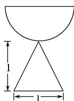
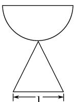
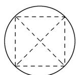

<!-- question-source:start -->
3. 一个由半球和四棱锥组成的几何体, 其三视图如图所示, 则该几何体的体积为( )

  
正视图

  
侧视图

  
俯视图

A. $\frac{1}{3} +\frac{2}{3}\pi$ B. $\frac{1}{3} +\frac{\sqrt{2}}{3}\pi$ C. $\frac{1}{3} +\frac{\sqrt{2}}{6}\pi$ D. $1 + \frac{\sqrt{2}}{6}\pi$
<!-- question-source:end -->

![[高中/总复习/专题/立体几何/专题01 关于3视图还原几何体的深度剖析与秒杀-立体几何（文理通用）/专题01_关于3视图还原几何体的深度剖析与秒杀/对点训练/answers/Q00050962A1.md]]
